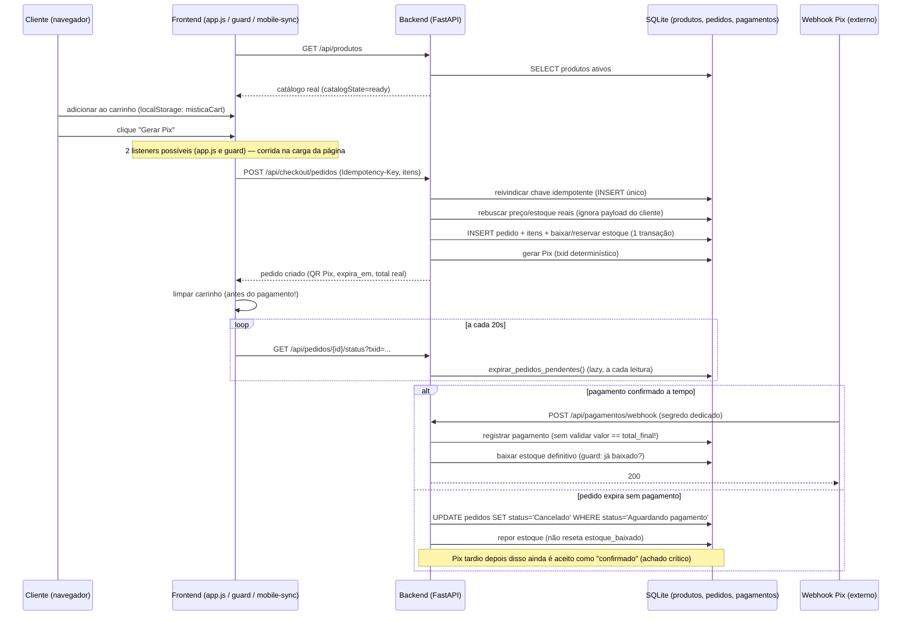

# Auditoria Fase 2 — Fluxo Comercial Completo

Branch: `audit/fase2-fluxo-comercial`
Base: `main` no commit `2b4a6b85736a2eaa4cd6e5952ea446c86145bed6` (merge do PR #309) ou posterior.
Status: **auditoria (diagnóstico). Nenhum código de produto foi alterado nesta etapa.**

Esta auditoria cobre o fluxo comercial completo: Produtos, Estoque, Carrinho, Checkout, Pedidos, Pix,
Cupons, Concorrência, Banco de Dados, API e Frontend. Foi feita por leitura direta do código atual
(pós PRs #298–#309), não do histórico de auditorias anteriores — os documentos `docs/issue-297-fase1-auditoria.md`
e `docs/issue-300-fase2-plano.md` foram usados apenas como ponto de partida para verificar o que já
tinha sido corrigido.

---

## 1. Arquitetura do fluxo comercial

### 1.1 Visão geral

```
Cliente → Catálogo → Carrinho → Checkout → Pedido → Pix → Confirmação de pagamento → Baixa de estoque → Pós-venda
```

O sistema tem **dois canais de venda** com implementações parcialmente distintas:

- **Site público** (`app.js`, `mobile-sync.js`, `site-production-guard.js`, `site-config.js` + backend
  `backend/preorder_checkout.py`, `backend/site_stock_routes.py`, `backend/payment_routes.py`,
  `backend/order_status_routes.py`) — cliente anônimo, pagamento via Pix.
- **Caixa/POS desktop** (`mistica_presentes.py`, `services/venda_service.py`, `services/caixa_service.py`,
  `services/pagamento_misto_service.py`) — operador humano, pagamento em dinheiro/cartão/misto.

Os dois canais compartilham o mesmo banco SQLite (`database/connection.py`) e as mesmas tabelas de
produtos/estoque/pedidos/pagamentos, mas têm caminhos de código, validação e garantias de atomicidade
diferentes (ver achados 4 e 15).

### 1.2 Fluxo do site público, passo a passo

1. **Carregamento da página** — `index.html` carrega scripts `defer`: `site-config.js` → `app.js` →
   `mobile-sync.js` → `v2-commerce.js`. `site-config.js` define `misticaCatalogState = "loading"` e
   bloqueia clique em `[data-generate-pix]`/`addToCart` até o catálogo real estar pronto. `app.js`
   grava imediatamente estado local (produtos demonstrativos + `saveState()`) no `localStorage`.
2. **Sincronização do catálogo** — `mobile-sync.js` chama `GET /api/produtos`. Sucesso → substitui
   catálogo local pelo real e marca `ready`. Falha → catálogo fica vazio e `error` (sem fallback
   demonstrativo comprável — corrigido desde a Fase 1).
3. **`DOMContentLoaded`** — `site-config.js` injeta **dinâmica e assincronamente**
   `site-production-guard.js`, que só então instala: bloqueio de gravação de chaves sensíveis no
   `localStorage`, substituição de `saveState()`, e um segundo listener (captura) para
   `[data-generate-pix]`.
4. **Adicionar ao carrinho** — `addToCart()` grava `misticaCart` no `localStorage` a cada alteração.
   Sem sincronização entre abas.
5. **Checkout / Gerar Pix** — dependendo de o guard já estar instalado ou não, o clique cai em
   `guardedGeneratePix()` (`site-production-guard.js`) ou em `generatePix()` (`app.js`). Ambos chamam
   a única função pública `window.misticaCriarPedido` (`mobile-sync.js`), que monta um payload mínimo
   e faz `POST /api/checkout/pedidos` com um header `Idempotency-Key`.
6. **Backend recalcula tudo** — `backend/preorder_checkout.py` / `backend/site_stock_routes.py`
   reivindicam a chave idempotente, rebuscam produto/preço/estoque **no banco**, ignoram
   preço/subtotal/desconto/total enviados pelo cliente, gravam pedido + itens + baixa/reserva de
   estoque em uma única transação, geram o Pix (`backend/pix.py`) e commitam.
7. **Resposta ao cliente** — QR Code, `pix_txid`, `expira_em`, total real.
8. **Acompanhamento** — polling a cada 20s em `GET /api/pedidos/{id}/status?txid=...`, protegido pelo
   `pix_txid` como capability token (sem exigir login do cliente).
9. **Limpeza do carrinho** — ocorre **assim que o pedido é criado**, não quando o pagamento é
   confirmado. O `misticaPendingOrderId` é gravado mas nunca relido para retomar um Pix pendente se o
   cliente sair da página.
10. **Confirmação de pagamento** — fora do frontend público: `POST /api/pagamentos` (painel) ou
    `POST /api/pagamentos/webhook` (integração externa, autenticada por segredo dedicado). Baixa o
    estoque definitivo (se ainda não baixado) e marca `Pagamento confirmado`.
11. **Expiração automática** — `expirar_pedidos_pendentes` roda sob demanda (a cada `GET /api/pedidos`)
    e em loop assíncrono a cada 60s no processo do servidor; cancela pedidos vencidos e repõe estoque
    de forma atômica (`UPDATE ... WHERE status='Aguardando pagamento'` como trava de corrida).

### 1.3 Diagrama do fluxo



---

## 2. Mapa de riscos

Cada achado é referenciado por um ID (Rn) usado na lista priorizada (seção 3) e no plano de PRs (seção 4).

### CRÍTICO

| ID | Achado | Onde |
|---|---|---|
| **R1** | `POST /api/pagamentos` (e o webhook, que reusa a mesma função) confirma pagamento **sem comparar `valor` com `pedidos.total_final`**. `valor=0` com `status=Confirmado` já marca o pedido como pago e baixa estoque. | `backend/payment_routes.py:58-105,124-168` |
| **R2** | Pagamento tardio (Pix pago depois de o pedido expirar/ser cancelado) é aceito sem revalidar o status atual do pedido. Estoque já foi reposto e possivelmente revendido a outro cliente; o pedido original ainda é marcado "Pagamento confirmado" sem garantia de produto disponível. | `backend/payment_routes.py:58-105` + `backend/order_status_routes.py:66-106,216-243` |
| **R3** | Pedido "sob encomenda" (estoque físico 0 por definição) não consegue avançar para "Pagamento confirmado"/"Separando pedido" — a baixa de estoque falha com 409 porque a regra não considera a flag `sob_encomenda`. Venda paga fica travada, ou operador é forçado a inflar estoque manualmente. | `backend/order_status_routes.py:134-213`, `backend/order_api_guard_inner_routes.py:55-56` |
| **R4** | `app.js` grava incondicionalmente chaves sensíveis (`misticaSales`, `misticaStock`, `misticaSuppliers`, backups) no `localStorage` **antes** de `site-production-guard.js` (carregado de forma assíncrona/dinâmica) instalar a proteção. Se o guard falhar ao carregar (bloqueador de anúncios, CSP, erro de rede, timeout de CDN), os dados ficam expostos permanentemente. Regressão não fechada do achado #4 da auditoria da Fase 1. | `app.js:60,366`, `site-production-guard.js:41-59` |

### ALTO

| ID | Achado | Onde |
|---|---|---|
| **R5** | Webhook Pix idempotente apenas por checagem simples (SELECT+INSERT), não por reivindicação atômica — duas chamadas concorrentes com o mesmo evento podem gerar dois registros de pagamento (a baixa de estoque em si é protegida por outro guard, mas o registro financeiro duplica). | `backend/idempotency.py:13-38`, `backend/payment_routes.py:71-73,102` |
| **R6** | Segredo do webhook Pix é estático (bearer fixo), sem verificação de assinatura por payload de um PSP real. Vazamento do segredo permite forjar confirmações de pagamento arbitrárias. | `backend/payment_routes.py:116-121` |
| **R7** | Rate limiting (login, cupom, checkout público) usa o primeiro valor de `X-Forwarded-For` sem validar proxy confiável — trivialmente contornável forjando o header a cada requisição, inclusive nos próprios testes do repositório. | `backend/rate_limit.py:12-16` |
| **R8** | `IntegrityError` do índice único de código de produto não é tratado: recriar um produto com o código de um produto **inativado** (soft delete) passa na validação da aplicação mas estoura erro 500 no `INSERT`, porque o índice único não filtra por `ativo`. | `backend/product_routes.py` (checagem `_codigo_duplicado` linhas 268-276 vs. `INSERT` 296-305), `database/migrations.py:363` |
| **R9** | Fluxo de caixa/POS (`registrar_venda_service`) nunca relê o **preço** do produto no momento de fechar a venda (só relê o custo) — usa o preço que já estava no carrinho em memória. Se o preço mudar entre o início do atendimento e o fechamento, a venda sai com preço desatualizado. | `services/venda_service.py:236-262` |
| **R10** | `/api/sync/venda` e `/api/sync/vendas-lote` (canal de sincronização do app desktop) aceitam `subtotal/desconto/total_final` do payload do cliente **sem recalcular no servidor**, ao contrário de todos os outros canais de venda do sistema. | `backend/user_sync_routes.py:345-364`, `_salvar_venda_conn` (linhas 155-237) |

### MÉDIO

| ID | Achado | Onde |
|---|---|---|
| **R11** | `/api/estoque/reservar` decrementa estoque sem `Idempotency-Key` e sem registrar movimentação/auditoria — retry de rede decrementa estoque de novo, sem rastro. | `backend/site_stock_routes.py:459-487` |
| **R12** | Cupons não têm limite de uso (nem por cupom, nem por cliente) — um cupom pode ser aplicado infinitas vezes por qualquer pessoa, sem controle de gasto total. | `database/migrations.py:334-351`, `backend/campaign_routes.py` |
| **R13** | Pagamento parcial/misto não é validado contra `total_final` no fluxo online: um único registro com valor menor que o total já marca o pedido como "Pagamento confirmado" e baixa estoque. | `backend/payment_routes.py:94-98`, `services/pagamento_misto_service.py` |
| **R14** | `Idempotency-Key` é opcional e definida pelo cliente; sem o header, não há nenhuma proteção contra pedido duplicado por duplo clique/retry (apenas overselling é protegido por outro mecanismo). | `backend/idempotency.py:18,33,63` |
| **R15** | Ausência de `FOREIGN KEY` declaradas em `pedidos_itens`, `pagamentos`, `pedido_status_log`, mesmo com `PRAGMA foreign_keys=ON` ativo — sem defesa de banco contra registros órfãos (hoje evitado só por disciplina do código). | `database/migrations.py` (schema dessas tabelas) |
| **R16** | Produto inativado durante um pedido pendente trava tanto a baixa quanto o estorno de estoque (`buscar_produto_para_baixa` filtra `ativo=1`), incluindo o caso de cancelamento não repor estoque. | `backend/order_status_routes.py:134-243` |
| **R17** | Dois listeners de clique para "Gerar Pix" continuam existindo estruturalmente (`app.js` e `site-production-guard.js`), com uma janela real de corrida enquanto o guard carrega de forma assíncrona. Hoje mitigado por idempotência no backend (não duplica pedido), mas sem debounce/feedback visual no caminho de `app.js`. | `app.js:344`, `site-production-guard.js:221-229` |
| **R18** | Carrinho não sincroniza entre abas (`storage` event não é escutado) — duas abas do mesmo navegador podem se sobrescrever, causando "sumiço" de item sem explicação. | `app.js:21` (nenhum listener de `storage` em nenhum `.js`) |
| **R19** | Carrinho é limpo assim que o pedido é criado, não quando o pagamento é confirmado; o Pix pendente nunca é reexibido se o cliente sair da página (`misticaPendingOrderId` é gravado mas nunca lido de volta). | `app.js:271`, `site-production-guard.js:76-80` |
| **R20** | `/api/estoque/baixo` é público (sem autenticação), expondo estoque atual e limiares mínimos de reposição de todos os produtos a qualquer visitante ou concorrente. | `backend/main.py:721-734` |
| **R21** | Avaliações de produto são publicadas automaticamente (`aprovado=1`) sem moderação, e o comentário não é sanitizado no backend (confia no frontend para escapar HTML). | `backend/review_routes.py` |
| **R22** | Rotas "duplicadas" em `order_api_guard_inner_routes.py` (`/api/vendas/{id}/cancelar`, `/api/pedidos/{id}/cancelar`, etc.) para as mesmas operações de `order_status_routes.py`, aumentando a superfície de API sem cobertura de teste dedicada garantindo paridade de comportamento. | `backend/order_api_guard_inner_routes.py` |
| **R23** | Sem timeout/`AbortController` em nenhum `fetch` do frontend — uma requisição pendurada mantém o botão de checkout bloqueado indefinidamente, sem opção de cancelar. | `mobile-sync.js:55-65` |

### BAIXO

| ID | Achado | Onde |
|---|---|---|
| **R24** | Nenhuma distinção entre produto digital e físico no modelo de dados/código — todo produto é tratado como físico com controle de estoque. | Ausência confirmada em `backend/`, `services/` |
| **R25** | `estoque_minimo` é aviso no POS e nem calculado no checkout do site — comportamento divergente entre os dois canais. | `services/estoque_service.py:18-41` vs. `backend/site_stock_routes.py:134-150` |
| **R26** | Faltam índices em `pagamentos(venda_id)` e `pedido_status_log(venda_id)`, colunas mais consultadas nessas tabelas. | `database/migrations.py` |
| **R27** | `POST /api/cupons/validar` sempre retorna HTTP 200 mesmo para cupom inválido, inconsistente com o 400 usado no checkout para o mesmo tipo de erro. | `backend/campaign_routes.py:121-132` |
| **R28** | `observacao` de pedido sem `max_length` no Pydantic — payload arbitrariamente grande gravado no banco. | `backend/order_status_routes.py` (`PedidoObservacaoIn`, linha 57-59) |
| **R29** | `GET /api/site/playlist-ambiente` retorna 200 mesmo em erro de banco, vazando a mensagem da exceção no corpo. | `backend/site_stock_routes.py:502-533` |
| **R30** | `tests/site-production-guard.test.js` não é um teste executável — é um roteiro de cenários em comentário, sem asserções reais; regressões nos cenários que documenta passam despercebidas. | `tests/site-production-guard.test.js` |
| **R31** | `test_persistencia_banco.py::test_acesso_simultaneo_de_duas_conexoes...` não usa guarda de piso nem barreira de largada — testa robustez de arquivo (WAL), não corretude de estoque sob corrida; pode dar falsa sensação de cobertura de concorrência. | `tests/test_persistencia_banco.py:98-125` |
| **R32** | `gerar_codigo_produto` em `services/produto_service.py` tem checagem de duplicidade diferente da usada pela rota principal (`_codigo_duplicado`) — se ainda estiver em uso ativo, é outra porta de entrada para o mesmo bug do R8. | `services/produto_service.py:13-20` |

---

## 3. Lista priorizada por impacto financeiro

| # | ID | Achado | Impacto financeiro |
|---|---|---|---|
| 1 | R1 | Pagamento confirmado sem validar valor vs. total do pedido | **Direto** — pode confirmar venda de qualquer valor pagando centavos, ou erro operacional gera baixa de estoque sem receita |
| 2 | R2 | Pix tardio pós-expiração confirma pedido sem garantir estoque | **Direto** — cliente pago sem produto reservado; risco de vender 2x o mesmo item ou não entregar o que foi pago |
| 3 | R3 | Pedido sob encomenda travado ao confirmar pagamento | **Direto** — venda já paga não pode ser processada/despachada sem gambiarra manual |
| 4 | R9 | POS não relê preço ao fechar venda | **Direto, recorrente** — toda vez que um preço muda no meio de um atendimento, a margem reportada é sistematicamente incorreta |
| 5 | R10 | `/api/sync/venda` aceita totais do cliente sem recálculo | **Direto** — único canal de venda do sistema sem autoridade de preço no servidor |
| 6 | R12 | Cupons sem limite de uso | **Indireto, potencialmente alto** — desconto pode ser aplicado sem limite de quantidade/gasto total |
| 7 | R13 | Pagamento parcial não validado contra total | **Direto** — pedido marcado "pago" com valor menor que o devido |
| 8 | R6 | Webhook sem verificação de assinatura por payload | **Indireto, alto se explorado** — vazamento do segredo permite confirmar pagamentos falsos em massa |
| 9 | R7 | Rate limit contornável (cupom/checkout/login) | **Indireto** — abre porta para enumeração de cupons e brute force; pode viabilizar exploração de R12 em escala |
| 10 | R11 | `/api/estoque/reservar` sem idempotência/auditoria | **Indireto** — estoque pode "sumir" sem rastro em retries de rede |
| 11 | R4 | localStorage inseguro antes do guard carregar | **Indireto** — exposição de dados de vendas/estoque no navegador do cliente, não é perda direta de caixa mas é vazamento de dado de negócio |
| 12 | R5 | Webhook idempotente por checagem simples, não atômica | **Indireto** — duplica registro financeiro em corrida rara |
| 13 | R8 | IntegrityError não tratado (código de produto reativado) | **Operacional** — erro 500 trava cadastro, sem perda de dinheiro direta, mas bloqueia operação |
| 14 | R16 | Produto inativo trava estorno de estoque | **Operacional** — estoque pode ficar "preso" sem visibilidade |
| 15 | R19 | Pix pendente não é retomável | **Indireto** — perda de venda por abandono evitável (cliente reinicia do zero) |
| 16 | R17/R18 | Corrida de listeners / multi-aba | **UX, indireto** — frustração do cliente, não duplica pedido (mitigado pelo backend) |
| 17 | R15/R26 | FKs e índices ausentes | **Estrutural** — não causa perda hoje, é dívida técnica que aumenta risco futuro |
| 18–32 | demais MÉDIO/BAIXO | Ver seção 2 | **Baixo/nenhum impacto financeiro direto hoje** |

---

## 4. Plano de execução — PRs independentes

Cada PR abaixo é pequeno, isolado, e pode ser revisado/mergeado independentemente. Nenhum foi aberto
nesta etapa — aguardando autorização.

### PR-1 — Validar valor do pagamento contra total do pedido (R1, R13)
- **Objetivo:** rejeitar (ou sinalizar explicitamente como parcial) confirmação de pagamento cujo
  valor não bate com `pedidos.total_final`; somar pagamentos parciais antes de marcar como confirmado.
- **Arquivos:** `backend/payment_routes.py`, `database/migrations.py` (se precisar de coluna de status
  parcial), testes novos em `tests/test_checkout_integrity.py` ou novo arquivo.
- **Risco:** médio (mexe no core de confirmação de pagamento) — precisa de cuidado para não quebrar
  fluxo de pagamento misto do POS.
- **Testes necessários:** valor exato confirma; valor menor não confirma (ou marca parcial); valor
  maior é aceito com alerta; webhook com valor divergente.
- **Estimativa:** M (2-3 dias).

### PR-2 — Revalidar status do pedido antes de aceitar pagamento tardio (R2)
- **Objetivo:** `registrar_pagamento` deve checar se `pedidos.status` ainda é `Aguardando pagamento`
  antes de confirmar; se já `Cancelado`/expirado, rejeitar ou alertar operador para decisão manual
  (estoque pode já ter sido revendido).
- **Arquivos:** `backend/payment_routes.py`, `backend/order_status_routes.py` (guard de estoque).
- **Risco:** médio-alto — decisão de negócio sobre o que fazer com Pix pago após expiração precisa de
  definição do usuário antes de implementar.
- **Testes necessários:** webhook chega após expiração — pedido não vira "confirmado" silenciosamente;
  cenário de reversão/estorno manual.
- **Estimativa:** M (2-3 dias), depende de decisão de produto.

### PR-3 — Corrigir baixa de estoque para pedidos sob encomenda (R3)
- **Objetivo:** `buscar_produto_para_baixa`/`baixar_estoque_do_pedido` devem reconhecer `sob_encomenda`
  e não exigir estoque físico suficiente para pedidos desse tipo.
- **Arquivos:** `backend/order_status_routes.py`.
- **Risco:** baixo-médio.
- **Testes necessários:** confirmar pagamento de pedido sob encomenda com estoque 0 avança de status
  sem erro; teste de regressão para pedido normal (deve continuar bloqueando por estoque insuficiente).
- **Estimativa:** P (1 dia).

### PR-4 — Corrigir `localStorage` inseguro antes do guard carregar (R4)
- **Objetivo:** unificar a lógica de persistência segura em um único ponto que executa **antes** de
  qualquer gravação, eliminando a dependência de `site-production-guard.js` carregar a tempo (ex.:
  mover a lógica para dentro de `app.js` diretamente, ou carregar o guard de forma síncrona/bloqueante
  antes de `app.js` rodar).
- **Arquivos:** `app.js`, `site-production-guard.js`, `index.html` (ordem de scripts).
- **Risco:** médio — mexe em ordem de carregamento, requer teste E2E com latência simulada.
- **Testes necessários:** novo teste Playwright com `page.route` atrasando `site-production-guard.js`,
  confirmando que chaves sensíveis nunca são gravadas mesmo assim.
- **Estimativa:** M (2-3 dias).

### PR-5 — Unificar listener único de checkout (R17)
- **Objetivo:** eliminar a duplicidade estrutural entre `app.js` e `site-production-guard.js` — um
  único listener, uma única função de checkout, com debounce/estado `checkoutRunning` desde o início.
- **Arquivos:** `app.js`, `site-production-guard.js`, `mobile-sync.js`.
- **Risco:** médio (retrabalho de arquitetura frontend).
- **Testes necessários:** clique duplo antes/depois do carregamento completo gera uma única requisição.
- **Estimativa:** M (3-4 dias) — pode ser combinado com PR-4.

### PR-6 — Idempotência atômica no webhook de pagamento (R5)
- **Objetivo:** trocar `resposta_idempotente_existente`/`salvar_resposta_idempotente` por
  `reivindicar_chave_idempotente` (o mecanismo já usado em criação de pedido) na rota de pagamento.
- **Arquivos:** `backend/payment_routes.py`, `backend/idempotency.py` (se precisar generalizar).
- **Risco:** baixo.
- **Testes necessários:** duas chamadas concorrentes com a mesma `Idempotency-Key`/txid geram um único
  registro de pagamento.
- **Estimativa:** P (1 dia).

### PR-7 — Assinatura de payload no webhook Pix (R6)
- **Objetivo:** avaliar com o usuário se há PSP real a integrar; se sim, migrar de segredo estático
  para verificação de assinatura HMAC por payload.
- **Arquivos:** `backend/payment_routes.py`, `backend/pix.py`.
- **Risco:** depende de decisão de produto/infra (qual PSP).
- **Estimativa:** M-G, depende de escopo definido pelo usuário.

### PR-8 — Corrigir rate limiting por IP forjável (R7)
- **Objetivo:** validar proxy confiável antes de aceitar `X-Forwarded-For`, ou usar identificador
  adicional (ex.: fingerprint de sessão) além do IP.
- **Arquivos:** `backend/rate_limit.py`.
- **Risco:** baixo-médio (depende de infraestrutura de deploy real — saber se há proxy confiável na
  frente).
- **Testes necessários:** IP forjado não reseta a janela do limitador.
- **Estimativa:** P-M (1-2 dias).

### PR-9 — Tratar `IntegrityError` de código de produto reativado (R8, R32)
- **Objetivo:** alinhar a checagem de duplicidade da aplicação com o índice único do banco (considerar
  produtos inativos), e adicionar `try/except` amigável ao redor do `INSERT`/`UPDATE` de produto.
- **Arquivos:** `backend/product_routes.py`, possivelmente `services/produto_service.py` se ainda ativo
  (confirmar antes).
- **Risco:** baixo.
- **Testes necessários:** recriar produto com código de um produto inativado retorna 409 amigável, não
  500.
- **Estimativa:** P (1 dia).

### PR-10 — Relê preço no fechamento de venda do POS (R9)
- **Objetivo:** `registrar_venda_service` deve relêr o preço atual do produto no momento de fechar a
  venda (como já faz com o custo), com opção de alertar o operador se o preço mudou.
- **Arquivos:** `services/venda_service.py`.
- **Risco:** baixo-médio — mudança de comportamento visível para o operador do caixa.
- **Testes necessários:** preço alterado entre adicionar ao carrinho e fechar venda reflete o preço
  correto (ou alerta).
- **Estimativa:** P-M (1-2 dias).

### PR-11 — Autoridade de preço em `/api/sync/venda` (R10)
- **Objetivo:** recalcular subtotal/desconto/total no servidor também nesse canal, alinhando com o
  restante do sistema.
- **Arquivos:** `backend/user_sync_routes.py`.
- **Risco:** médio — pode quebrar contrato existente do app desktop; precisa de coordenação de versão.
- **Testes necessários:** payload adulterado é ignorado, igual aos outros canais.
- **Estimativa:** M (2-3 dias).

### PR-12 — Limite de uso de cupom (R12)
- **Objetivo:** adicionar `limite_uso`/contador atômico (`UPDATE ... WHERE usos < limite_uso`, mesmo
  padrão do estoque) ao modelo de campanha.
- **Arquivos:** `database/migrations.py`, `backend/campaign_routes.py`, `backend/site_stock_routes.py`,
  `backend/preorder_checkout.py`.
- **Risco:** médio (schema change + lógica nova).
- **Testes necessários:** limite respeitado sob concorrência (dois checkouts disputando o último uso).
- **Estimativa:** M-G (3-5 dias) — requer decisão de produto sobre granularidade do limite (global vs.
  por cliente).

### PR-13 — Idempotência em `/api/estoque/reservar` + auditoria (R11)
- **Objetivo:** adicionar `Idempotency-Key` e registro em `movimentacao_estoque`/`audit_log` nessa rota.
- **Arquivos:** `backend/site_stock_routes.py`.
- **Risco:** baixo.
- **Estimativa:** P (1 dia).

### PR-14 — Autenticar `/api/estoque/baixo` (R20)
- **Objetivo:** exigir sessão/chave de API, igual às demais rotas administrativas de estoque.
- **Arquivos:** `backend/main.py`.
- **Risco:** baixo (verificar se algum consumidor legítimo depende do acesso público, o que não foi
  encontrado nesta auditoria).
- **Estimativa:** P (menos de 1 dia).

### PR-15 — Declarar FKs em `pedidos_itens`, `pagamentos`, `pedido_status_log` (R15)
- **Objetivo:** adicionar `REFERENCES` no schema, coordenado com `scripts/auditoria_integridade_referencial.py`
  para verificar ausência de órfãos antes de aplicar a constraint.
- **Arquivos:** `database/migrations.py`.
- **Risco:** médio (migração de schema em banco de produção precisa de cuidado, mesmo sendo aditiva).
- **Estimativa:** M (2-3 dias, incluindo validação de dados existentes).

### PR-16 — Produto inativo não deve travar baixa/estorno de pedido pendente (R16)
- **Objetivo:** `buscar_produto_para_baixa` não deve filtrar por `ativo=1` quando o objetivo é apenas
  localizar o produto para ajuste de estoque de um pedido já existente.
- **Arquivos:** `backend/order_status_routes.py`.
- **Risco:** baixo.
- **Estimativa:** P (1 dia).

### PR-17 — Retomar Pix pendente ao reabrir o site (R19)
- **Objetivo:** ler `misticaPendingOrderId` na inicialização e oferecer retomar o acompanhamento do
  Pix, se ainda válido.
- **Arquivos:** `app.js`, `mobile-sync.js`.
- **Risco:** baixo.
- **Estimativa:** P-M (1-2 dias).

### PR-18 — Sincronizar carrinho entre abas (R18)
- **Objetivo:** escutar evento `storage` e reconciliar o carrinho em memória com o `localStorage`.
- **Arquivos:** `app.js`.
- **Risco:** baixo.
- **Estimativa:** P (1 dia).

### PR-19 — Timeout/cancelamento de requisição de checkout travada (R23)
- **Objetivo:** adicionar `AbortController` com timeout razoável nas chamadas de checkout/Pix, com
  mensagem de erro clara e liberação do botão.
- **Arquivos:** `mobile-sync.js`.
- **Risco:** baixo.
- **Estimativa:** P (1 dia).

### PR-20 — Itens de baixo risco/limpeza (R21, R22, R26, R27, R28, R29, R30, R31)
- **Objetivo:** lote de correções pequenas e independentes: moderação/sanitização de avaliações,
  remoção ou justificativa das rotas duplicadas em `order_api_guard_inner_routes.py`, índices faltantes,
  código HTTP consistente em `/api/cupons/validar`, `max_length` em observação de pedido, não vazar
  exceção em `playlist-ambiente`, substituir `tests/site-production-guard.test.js` por teste real,
  reforçar `test_persistencia_banco.py` com guarda de piso real.
- **Arquivos:** múltiplos, mas cada mudança é independente — pode virar vários PRs menores se preferir
  granularidade máxima.
- **Risco:** baixo.
- **Estimativa:** G no total (5+ dias), mas cada item individual é P.

---

## 5. Cobertura de testes

### Já protegido (testes reais, verificados por leitura do conteúdo, não só do nome)

- **Concorrência real de estoque na última unidade** — `tests/test_checkout_concurrency.py`,
  `tests/test_order_tracking_idempotency.py` (threads + `Barrier` + requisições HTTP simultâneas).
- **Autoridade de preço/subtotal/desconto no checkout do site e em `/api/vendas`** — payload adulterado
  é sempre ignorado (`tests/test_checkout_integrity.py`, `tests/test_api_basica.py`).
- **Idempotência de criação de pedido** (mesma chave não duplica; chave reutilizada com payload
  diferente dá 409; concorrência real com mesma chave) — `tests/test_order_tracking_idempotency.py`.
- **Ciclo de vida de estoque em pedidos**: confirmação repetida não baixa duas vezes; expiração
  repetida não repõe em dobro; encomenda expirada não mexe em estoque físico —
  `tests/test_order_stock_lifecycle.py`.
- **Regras de encomenda**: limite máximo, ciência obrigatória do cliente, carrinho misto bloqueado —
  `tests/test_preorder_checkout.py`, `tests/test_product_preorder_rules.py`.
- **Integridade de cadastro de produto**: código duplicado (criação/edição), preço/custo inválidos,
  URLs perigosas, lucro sempre recalculado no servidor — `tests/test_product_integrity.py`.
- **Acesso público a status/recibo do pedido** protegido por `pix_txid`, com anti-enumeração (403
  genérico) — `tests/test_order_tracking_idempotency.py`.
- **Desconto/taxa de cartão do caixa físico (POS)** — `tests/test_venda_caixa.py`.
- **Persistência entre reaberturas do banco, WAL não corrompe sob escrita concorrente** (mas não é
  teste de corretude de negócio, ver R31) — `tests/test_persistencia_banco.py`.
- **Foreign keys ativas (`PRAGMA foreign_keys=ON`)**, testado apenas para `curso_aulas` (LMS), não para
  as tabelas comerciais (ver R15) — `tests/test_sqlite_foreign_keys.py`.

### Sem teste (lacunas confirmadas)

- Confirmação de pagamento com `valor` diferente do `total_final` (R1) — nenhum teste força esse caso.
- Pagamento tardio após expiração/cancelamento do pedido (R2) — nenhum teste simula esse timing.
- Transição de status de pedido sob encomenda após pago (R3).
- Webhook duplicado/concorrente com o mesmo txid (R5) — não há teste HTTP disparando duas chamadas
  simultâneas ao webhook.
- `/api/estoque/reservar` — nenhum teste de idempotência ou retry.
- Recriação de produto com código de produto inativado (R8).
- Preço desatualizado no fechamento de venda do POS (R9).
- Cupom `desconto_fixo`, `frete_gratis`, expirado, não iniciado, ou `ativo=0` — só `desconto_percentual`
  é testado.
- Limite de uso de cupom (não implementado, portanto não testável ainda).
- Corrida entre expiração automática e confirmação de pagamento no mesmo instante.
- Multi-aba no carrinho (R18) — nenhum teste com duas páginas Playwright simultâneas.
- Corrida de listeners de checkout com latência real no carregamento do guard (R4, R17) — os testes
  E2E atuais sempre esperam `catalogState === "ready"`, dando tempo de sobra ao guard local.
- Timeout de requisição de checkout travada (R23).

### Testes frágeis / a revisar

- `tests/site-production-guard.test.js` não executa nenhuma asserção real (R30).
- `tests/test_persistencia_banco.py::test_acesso_simultaneo_de_duas_conexoes...` não usa guarda de piso
  nem barreira de largada — não prova corretude de negócio sob corrida (R31).
- Testes de concorrência dependem de timeouts de 10-20s e de `time.sleep(0.15)` internos ao mecanismo de
  idempotência — podem ficar instáveis (flaky) sob CI sob carga.

### Testes redundantes

- `test_venda_recalcula_precos_e_ignora_valores_do_cliente`, `test_estoque_reservado_na_criacao...`
  (`tests/test_api_basica.py`) e `test_checkout_ignora_preco_subtotal_desconto_taxa_e_total_do_navegador`
  (`tests/test_checkout_integrity.py`) testam essencialmente a mesma garantia em rotas diferentes —
  aceitável (cada rota merece a prova), mas vale registrar que é o mesmo padrão repetido três vezes.

---

## 6. Conclusão

### O sistema está pronto para vender?

**Parcialmente.** As garantias mais fundamentais contra perda de dinheiro por manipulação do
cliente já existem e estão bem testadas: o backend nunca confia em preço, subtotal, desconto ou total
vindos do navegador no checkout do site, e a concorrência sobre a última unidade de estoque é tratada
corretamente com testes de corrida reais. Isso é a base mais importante e já está sólida.

Porém, existem **4 riscos CRÍTICOS** que afetam diretamente dinheiro e integridade de pedidos e que
não deveriam ficar em produção sem correção: confirmação de pagamento sem validar o valor pago (R1),
aceitação de pagamento tardio sem revalidar o estado do pedido (R2), pedidos sob encomenda travados no
momento de confirmar pagamento (R3), e uma janela real de exposição de dados sensíveis no navegador do
cliente antes da proteção de produção carregar (R4).

### Quais riscos ainda impedem a operação?

Na ordem em que bloqueiam operação real:

1. **R3** (sob encomenda trava ao confirmar pagamento) — impede processar uma venda já paga, é um
   bloqueio operacional direto e reproduzível hoje, sempre que houver uma venda sob encomenda.
2. **R1** (pagamento sem validar valor) — não impede operar, mas é uma porta aberta para perda de
   dinheiro por erro humano ou uso indevido da chave de API/webhook.
3. **R2** (Pix tardio pós-expiração) — cenário raro mas real em qualquer loja com Pix (cliente demora
   para pagar), gera pedido "pago" sem garantia de produto.
4. **R4** (localStorage inseguro) — não impede vender, mas é uma falha de proteção de dados que
   depende de sorte (o guard carregar a tempo) em cada carregamento de página.

### O que deve ser corrigido primeiro?

Nesta ordem: **PR-3 (sob encomenda travado) → PR-1 (validar valor do pagamento) → PR-2 (pagamento
tardio) → PR-4 (localStorage inseguro) → PR-9 (IntegrityError de produto) → PR-10 (preço no POS)**.
Os quatro primeiros são os únicos com risco direto e imediato de dinheiro ou operação bloqueada; os
dois seguintes já causam erro/perda em cenários do dia a dia (recadastro de produto, reajuste de
preço). O restante (cupons, idempotência do webhook, rate limit, FKs, itens de frontend/UX) é
importante mas pode ser sequenciado depois sem risco imediato.

### Qual a estimativa de PRs para concluir a Fase 2?

**20 PRs** conforme o plano da seção 4 (PR-1 a PR-20, sendo o PR-20 um lote de itens pequenos que pode
ser subdividido). Estimativa de esforço total: aproximadamente **7-8 semanas** de trabalho sequencial
de um desenvolvedor (mais rápido se PRs independentes forem paralelizados), assumindo que PR-2, PR-7,
PR-11 e PR-12 exigem decisões de produto do usuário antes de começar a implementação (não são apenas
correções técnicas — envolvem regras de negócio a definir: o que fazer com Pix pago após expiração,
se há PSP real a integrar, como versionar o contrato de sync do app desktop, e qual a granularidade do
limite de cupom).

Nenhuma correção foi implementada nesta etapa. Aguardando aprovação para iniciar os PRs, na ordem
sugerida acima ou na ordem que preferir.
